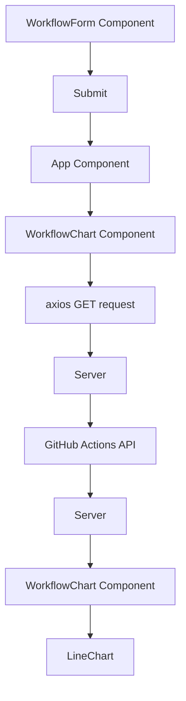

# GitHub Actions Visualizer

This repository is designed to visualize GitHub Actions workflows. It fetches data from the GitHub Actions API and displays it in a line chart. The main components of this repository are the `app.js` file, which serves as the backend server, and the `github-actions-visualizer` directory, which contains the frontend React application.

## Directory Structure

- `app.js`: This is the main server file. It defines two endpoints: one for the root URL and one for fetching workflow data.
- `github-actions-visualizer`: This directory contains the frontend React application. Key files include:
  - `App.js`: This is the main React component. It renders the `WorkflowForm` and `WorkflowChart` components.
  - `WorkflowForm.js`: This component allows the user to input the owner, repo, and workflow ID.
  - `WorkflowChart.js`: This component fetches the workflow data from the server and displays it in a line chart.

## Functionality

The `app.js` file defines a GET endpoint at `/workflow/:owner/:repo/:workflow`. This endpoint fetches workflow data from the GitHub Actions API using the provided owner, repo, and workflow ID. It uses the `axios` library to send the API request and the `GITHUB_TOKEN` environment variable for authentication.

The `WorkflowForm` component in `WorkflowForm.js` is a simple form that takes the owner, repo, and workflow ID as input. When the form is submitted, it calls the `onSubmit` prop with the input values.

The `WorkflowChart` component in `WorkflowChart.js` fetches the workflow data from the server when it receives new props. It uses the `axios` library to send the GET request and the `recharts` library to display the data in a line chart.

```javascript
app.get('/workflow/:owner/:repo/:workflow', async (req, res) => {
  const { owner, repo, workflow } = req.params;
  // ...
});
```

## Diagram



This diagram represents the flow of data in the application. The user inputs the owner, repo, and workflow ID in the `WorkflowForm` component. When the form is submitted, the `App` component updates the props of the `WorkflowChart` component, which fetches the workflow data from the server and displays it in a line chart.

## Getting Started

To use this repository, you will need to have Node.js and npm installed on your machine. Clone the repository, navigate to the project directory, and install the dependencies:

```bash
git clone https://github.com/your-username/your-repo-name.git
cd your-repo-name
npm install
```

Then, start the development server:

```bash
npm start
```

Open [http://localhost:3000](http://localhost:3000) to view the application in your browser.
